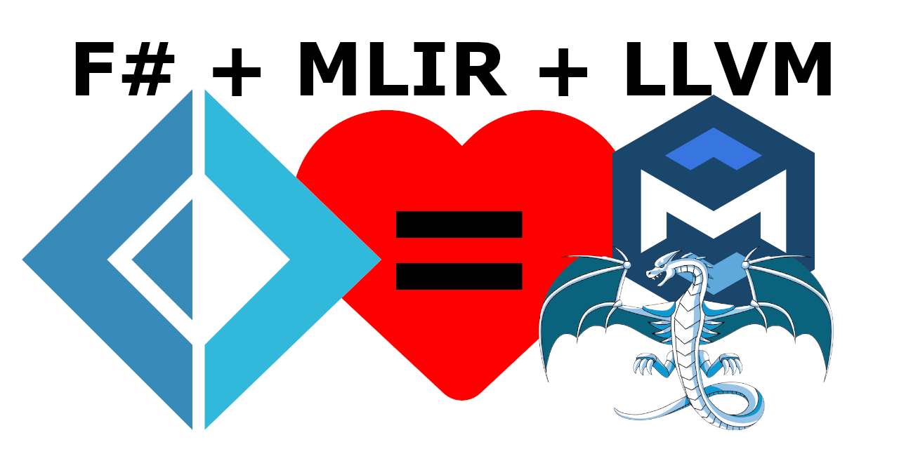

# F# to Native Executable Compiler Pipeline



## Project Overview

### Toolchain Dependencies
- MLIR libraries
- LLVM infrastructure
- F# Compiler Service
- PowerShell (for build scripting)
- MSYS2 or equivalent MinGW development environment


This project represents an experimental proof-of-concept for compiling F# directly to native executables using MLIR (Multi-Level Intermediate Representation) and LLVM, bypassing traditional .NET compilation infrastructure.


## MLIR and LLVM Toolchain Setup with MSYS2 Windows Installer

The MLIR and LLVM toolchain was acquired through the official MSYS2 Windows installer package, which provides a streamlined method for obtaining development tools and libraries for Windows.

### Packages
   Utilized the MSYS2 package manager (pacman) to install necessary development tools and libraries:
   ```bash
   pacman -Syu  # Update package database and core system packages
   pacman -S mingw-w64-x86_64-toolchain
   pacman -S mingw-w64-x86_64-llvm
   pacman -S mingw-w64-x86_64-clang
   pacman -S mingw-w64-x86_64-cmake
   pacman -S mingw-w64-x86_64-ninja
   ```

### General Project Structure
- `src/`: Source code for the compiler pipeline
  - `Bindings/`: Native bindings for MLIR and LLVM
  - `Conversion/`: AST conversion logic
  - `Pipeline/`: Compilation pipeline implementation
  - `Examples/`: Sample F# programs
- `tools/`: Build and development scripts
- `build/`: Compiled output directory

### Compilation Architecture

The compiler pipeline consists of several critical stages:
1. F# Source Parsing
2. Abstract Syntax Tree (AST) Conversion
3. MLIR Dialect Generation
4. LLVM IR Lowering
5. Native Code Generation

## Build Notes
Check path settings to match your project and dependency locations

### Compilation Caveats

#### F# Compiler Service Integration
The project uses a standalone F# Compiler Service instance, which is intentionally decoupled from the standard .NET ecosystem. This approach introduces several non-standard elements:

- The F# Compiler Service is compiled as a discrete library
- Build scripts use direct PowerShell orchestration to compile
- Type resolution and binding are hand-jammed in many cases

**Warning**: This implementation is inherently experimental and should be considered a research prototype.

## Build Process

Execute the compilation pipeline using the provided PowerShell script:

```powershell
.\tools\build.ps1
```

### Build Stages
1. Compile F# MLIR Bindings
2. Compile MLIR Wrapper Modules
3. Generate Conversion Modules
4. Build Compilation Pipeline
5. Create Example Executables


## Limitations and Future Work

Current limitations include:
- Minimal language feature support
- Experimental parsing mechanisms
- Limited optimization strategies
- No Garbage Collection (GC)

Potential future improvements:
- Enhanced type system mapping
- More comprehensive language construct support
- Advanced optimization passes
- Memory management
- Garbage Collection

## Licensing and Contribution

This is an MIT licensed open-source research project. Contributions, discussions, and explorations are welcome.

## Disclaimer

This compiler pipeline is a proof-of-concept. It is not intended for production use and represents an experimental approach to functional language compilation.

## .NET 9 compilation sizes for the same functionality

### Standard Debug Build


### Production build


